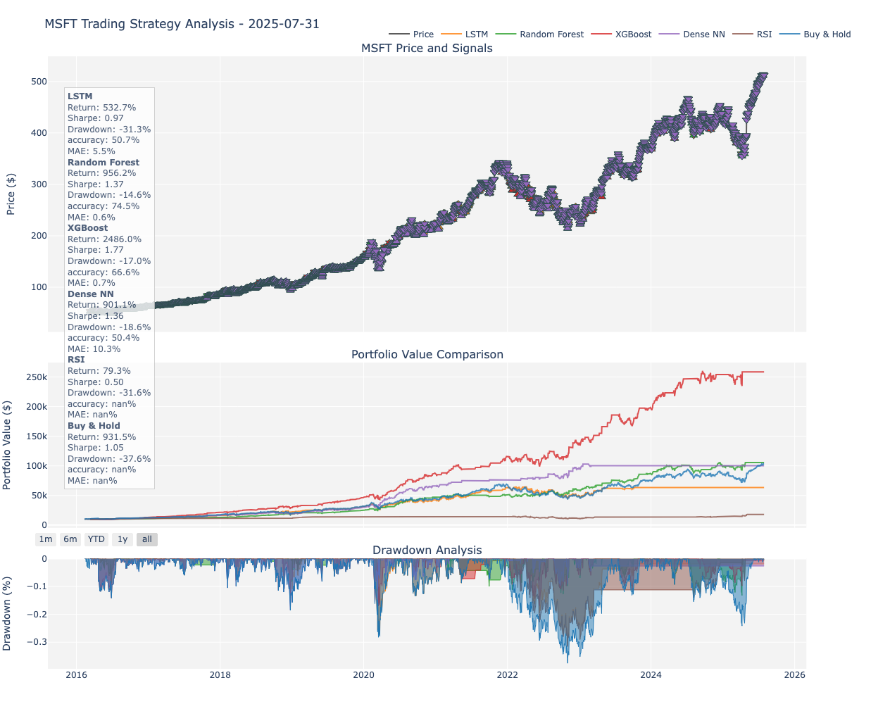

# Trading
## ML and algo trading bot
Example of Backtesting results for Apple stock:



The dashboard includes every stock and ETF in `ticker_config.py`, including HOLD
and low-confidence predictions. Email reports retain their strong-signal filter.

Use Python 3.11 and install `requirements.txt`; the model-library versions are
pinned to match the serialized models.

To refresh market history, retrain all six models per ticker, and rebuild the
dashboard without placing orders or sending email:

```sh
python retrain_models.py --workers 2
```

For a smaller run, add `--tickers AAPL MSFT`. Each ticker trains in a separate
process. New models and predictions are validated before replacing saved files;
previous model/data files are backed up under the run's `logs/retrain_*` directory.
Progress and per-ticker logs are kept there, with a final report at
`results/retrain_status.json`. Training or prediction validation failures leave
the previous models and predictions in place and make the command exit with an error. The prediction
date on each dashboard card identifies the market-data date (older summaries
fall back to their original generation date).

To rebuild only the local dashboard from saved predictions:

```sh
python -c "from web_dev.web_dashboard import generate_dashboard; generate_dashboard()"
```

These commands update local files. Publishing the dashboard uses the existing
GitHub Pages workflow.
